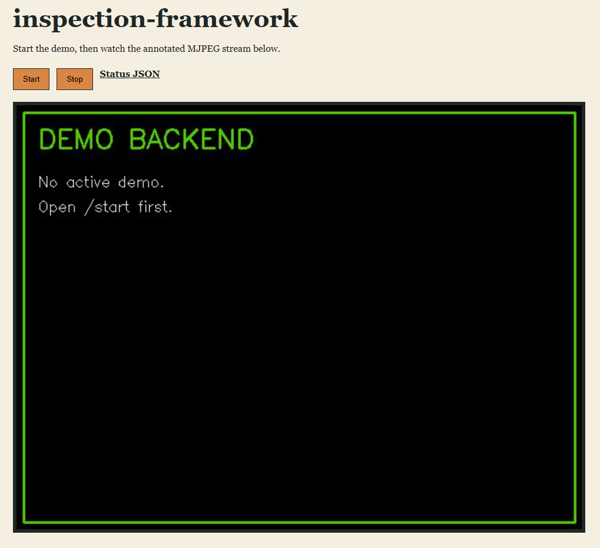

# inspection-framework

Starter webcam object-detection framework built with Flask, cam2ip, and YOLO11n.

The app starts a local webcam MJPEG server with `cam2ip`, runs YOLO inference in a Python worker, and streams annotated frames back to a browser. It is intentionally small so the runtime flow is easy to inspect, test, and modify.

## Demo

The screenshot below shows the browser UI served by the Flask backend.



## What This Project Does

- Serves a simple browser UI at `http://localhost:5000/`.
- Starts and stops a local `cam2ip` process from the API.
- Reads webcam frames from `http://127.0.0.1:56000/mjpeg`.
- Runs YOLO inference on each frame.
- Exposes live MJPEG output, snapshots, health, and status endpoints.
- Keeps tests independent from a real webcam, model download, or `cam2ip` process.

## Repository Layout

```text
.
├── main.py            # Flask server entry point
├── app.py             # Application state, YOLO model loading, demo lifecycle
├── api.py             # HTTP API and browser page
├── camera.py          # cam2ip process management and MJPEG frame reader
├── worker.py          # YOLO inference worker
├── config.py          # Public demo configuration
├── det_logger.py      # Lightweight runtime logger
├── test_main.py       # pytest coverage for config, API, camera, and worker behavior
├── requirements.txt   # Python dependencies
├── pyproject.toml     # Project metadata and pytest configuration
├── pic/               # README screenshots
└── ckpt/              # Local model checkpoint location, not for committed model files
```

## Runtime Flow

```text
Browser or API client
  -> /start
      -> start cam2ip.exe
      -> wait for http://127.0.0.1:56000/mjpeg
      -> load YOLO model
      -> start MJPEG frame reader thread
      -> start detection worker thread
  -> /stream
      -> return annotated MJPEG frames
```

## Requirements

- Python 3.10 or newer
- A webcam available to the host machine
- A local `cam2ip` binary
- A YOLO model file, usually `yolo11n.pt`

This project is Windows-oriented by default because the bundled local path expects `cam2ip.exe`. The Python code itself is mostly portable, but non-Windows users should set `CAM2IP_EXE` to their local binary path.

## Setup

```powershell
python -m venv .venv
.\.venv\Scripts\Activate.ps1
python -m pip install --upgrade pip
python -m pip install -r requirements.txt
```

Place your YOLO model at:

```text
ckpt/yolo11n.pt
```

If the model is stored elsewhere, set `YOLO_MODEL`:

```powershell
$env:YOLO_MODEL='C:\path\to\yolo11n.pt'
```

If `YOLO_MODEL` is only a filename, such as `yolo11n.pt`, the app first checks the `ckpt` directory for that file.

## cam2ip Setup

By default, the app looks for:

```text
cam2ip-1.4/cam2ip-1.4/cam2ip.exe
```

Download `cam2ip` separately and place the executable there, or override the path:

```powershell
$env:CAM2IP_EXE='C:\path\to\cam2ip.exe'
```

Do not commit third-party binaries, DLLs, or model checkpoint files to this repository. Keep them local or publish them through a release artifact system with the correct licenses.

## Run

```powershell
python main.py
```

Open:

```text
http://localhost:5000/
```

Click `Start` to launch `cam2ip` and the YOLO detection worker.

## API

| Method | Path | Description |
| --- | --- | --- |
| GET | `/` | Browser demo page |
| GET | `/ping` | Liveness check |
| GET | `/health` | Server, model, `cam2ip`, and worker status |
| GET | `/status` | Current runtime status |
| GET/POST | `/start` | Start `cam2ip` and the YOLO worker |
| GET/POST | `/stop` | Stop the worker and managed `cam2ip` process |
| GET | `/snapshot` | Latest annotated JPEG frame |
| GET | `/stream` | Live annotated MJPEG stream |

### `/start` Query Options

| Parameter | Default | Description |
| --- | --- | --- |
| `index` | `0` | Webcam device index |
| `width` | `640` | Capture width passed to `cam2ip` |
| `height` | `480` | Capture height passed to `cam2ip` |
| `delay` | `30` | `cam2ip` frame delay in milliseconds |
| `conf` | `0.35` | YOLO confidence threshold |
| `imgsz` | `640` | YOLO input image size |
| `model` | `ckpt/yolo11n.pt` | YOLO model path or filename |

Example:

```text
http://localhost:5000/start?index=0&width=640&height=480&conf=0.35
```

## Configuration

| Environment Variable | Default |
| --- | --- |
| `BACKEND_HOST` | `0.0.0.0` |
| `BACKEND_PORT` | `5000` |
| `CAM2IP_EXE` | `cam2ip-1.4/cam2ip-1.4/cam2ip.exe` |
| `CAMERA_INDEX` | `0` |
| `CAMERA_WIDTH` | `640` |
| `CAMERA_HEIGHT` | `480` |
| `CAMERA_DELAY_MS` | `30` |
| `CKPT_DIR` | `ckpt` |
| `YOLO_MODEL` | `ckpt/yolo11n.pt` |
| `YOLO_CONF` | `0.35` |
| `YOLO_IMGSZ` | `640` |
| `JPEG_QUALITY` | `80` |
| `STREAM_WAIT_TIMEOUT` | `0.1` |
| `AUTO_START_DEMO` | `0` |

To start the demo as soon as the server starts:

```powershell
$env:AUTO_START_DEMO='1'
python main.py
```

## Tests

```powershell
python -m pytest test_main.py -v
```

The tests validate public-safe structure and API behavior without requiring a real webcam, `cam2ip`, or a downloaded YOLO model.

## Troubleshooting

| Symptom | Check |
| --- | --- |
| `/start` cannot find `cam2ip` | Verify `CAM2IP_EXE` or the default local folder layout |
| `cam2ip` does not become ready | Check whether another app is using the webcam |
| Model loading is slow | Confirm that `ckpt/yolo11n.pt` already exists locally |
| `/stream` only shows the waiting frame | Check `/status` for `cam2ip.ready` and `worker.last_error` |
| Wrong webcam is selected | Try another device index, for example `/start?index=1` |

## Public Repository Notes

This repository is prepared for public sharing as a compact starter framework. The following are intentionally not committed:

- Local virtual environments and Python caches
- IDE settings
- Runtime logs
- YOLO model checkpoint files
- `cam2ip` binaries and DLLs
- Local environment files and personal auth files

Before publishing changes, run the tests and review `git status` so only source code, tests, documentation, and screenshots are staged.
